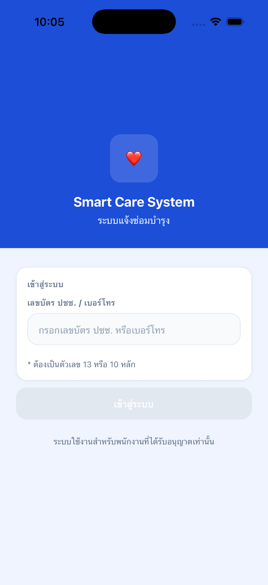
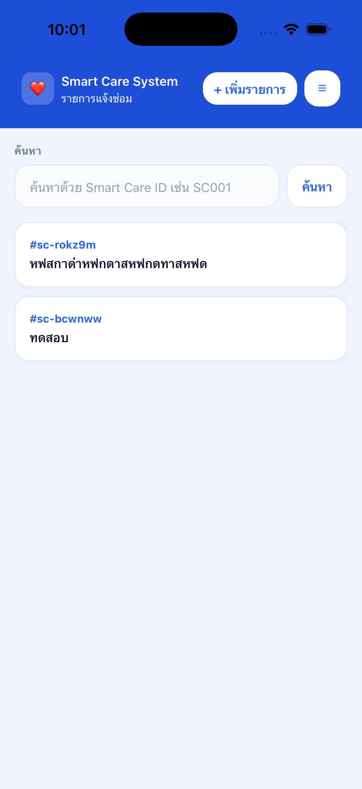
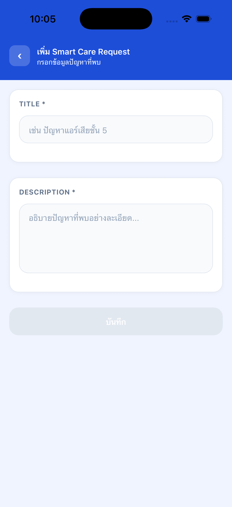
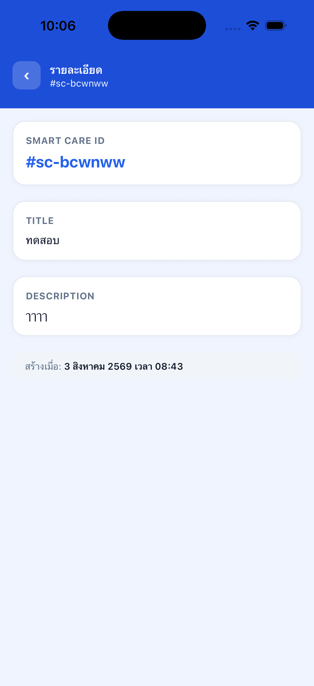

# Smart Care System

React Native (CLI) application for reporting internal office issues and requesting support. Built as a technical assessment submission.

**Screens:** Login → Main → Add Request → Request Detail

**Wireframe:** [Figma — Smart Care System](https://www.figma.com/design/zkuQlprhLXhqmrheS6StAK/Smart-Care-System)

Full specification and implementation decisions are documented in [PLAN.md](./PLAN.md) and [CLAUDE.md](./CLAUDE.md).

## Screenshots

| Login | Main | Add Request | Request Detail |
| --- | --- | --- | --- |
|  |  |  |  |

## Tech Stack

| Layer           | Choice                                            |
| --------------- | -------------------------------------------------- |
| Framework       | React Native (CLI) — no Expo Router                |
| Language        | TypeScript (strict mode)                           |
| Navigation      | react-navigation (Native Stack)                    |
| Forms           | react-hook-form + Zod (`@hookform/resolvers/zod`)  |
| State           | Redux Toolkit                                      |
| Persistence     | redux-persist                                      |
| Testing         | Jest + React Native Testing Library                |
| Package manager | pnpm                                               |
| Tooling         | ESLint + Prettier                                  |

## Getting Started

### Prerequisites

- Node.js, pnpm
- iOS: Xcode + CocoaPods
- Android: Android Studio + SDK

### Install

```bash
pnpm install
```

> This project pins `node-linker=hoisted` in `.npmrc` (already included). React Native's Metro bundler and Jest do not yet fully support pnpm's default symlinked `node_modules/.pnpm` layout.

### Run

```bash
pnpm start        # Metro bundler
pnpm android       # requires an Android emulator/device + Android SDK
pnpm ios           # requires Xcode + CocoaPods (bundle install && bundle exec pod install in ios/ on first run)
```

### Test & Lint

```bash
pnpm test
pnpm lint
```

## Project Structure

```
src/
  screens/          # Login, Main, AddRequest, RequestDetail
  components/       # Button, Input, Card, Modal
  navigation/        # RootStackParamList + Stack Navigator
  store/
    slices/          # authSlice, smartCareSlice
    store.ts
    persistConfig.ts
  schemas/          # Zod validation schemas
  theme/            # colors, spacing, typography tokens
  utils/            # id generator, date formatter
  types/
```

## Design Decisions

The original wireframe/spec left two flows unspecified; the following decisions were made during implementation and are also detailed in [PLAN.md](./PLAN.md#5-open-decisions-already-made-ไม่ตรงกับสเปคเป๊ะ-แต่-confirm-แล้วโดยผู้สมัคร):

1. **Add Request submits back to Main**, not to the newly created item's Request Detail — the spec did not define a destination, and Main surfaces the new item in the list immediately.
2. **A failed search on Main shows a modal**, rather than inline error text or filtering the list — this keeps "not found" distinct from the list's own empty state.

The wireframe copy also contained a typo ("กรอง..." instead of "กรอก..."), corrected directly in code rather than in Figma.

## testID Convention

BEM-inspired format: `[context]__[element]--[type]`, kebab-case, passed via the `testID` prop (based on [juntossomosmais/frontend-guideline](https://github.com/juntossomosmais/frontend-guideline)). See [CLAUDE.md](./CLAUDE.md#testid-conventions) for the full convention and examples.

## Known Limitations

- Verified on simulator (manual run-through of the Login → Main → Add Request → Request Detail flow) plus `pnpm lint` and `pnpm test` (typecheck passes, all tests pass).
- Design tokens (`src/theme/`) are reasonable defaults defined in code and are not synced with real Figma variables (see [PLAN.md](./PLAN.md#7-figma) — skipped intentionally to save time).

## AI-Assisted Development

Claude Code was used throughout this project's workflow, following the roles defined in `.claude/agents/`:

| Role        | Subagent   | Responsibility                                                          |
| ----------- | ---------- | ------------------------------------------------------------------------- |
| Planner     | `ba`       | Clarifies requirements/acceptance criteria before implementation; no code |
| Design      | `design`   | Reviews/proposes visual direction, syncs design tokens with Figma         |
| Implementor | `frontend` | Implements screens/components/state per `CLAUDE.md`                       |
| Reviewer    | `qa`       | Checks work against acceptance criteria, testID convention, build health  |

**Flow:** `ba` (plan, no code) → approve → `frontend` (implement + test) → `qa` (review, reports only, no fixes) → done

**Custom slash commands** (`.claude/commands/`): `/new-screen`, `/gen-test`, `/review-a11y`

**Principles:** AI is used to scaffold boilerplate for speed, but critical logic (validation, reducers, business rules) is reviewed and understood before every commit. Business rules not covered by the spec are never guessed (see Design Decisions above). No code is committed without being fully understood.
